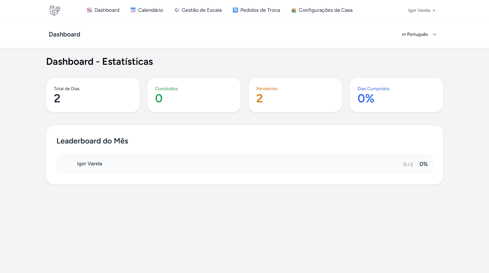
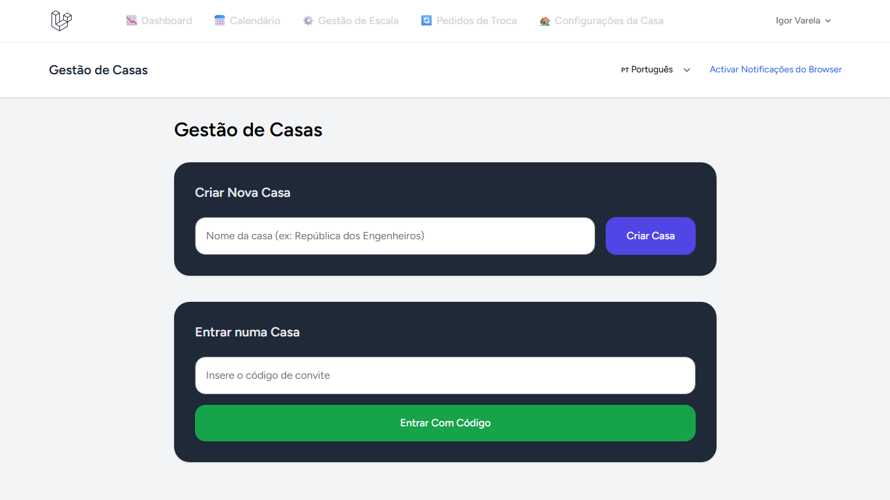
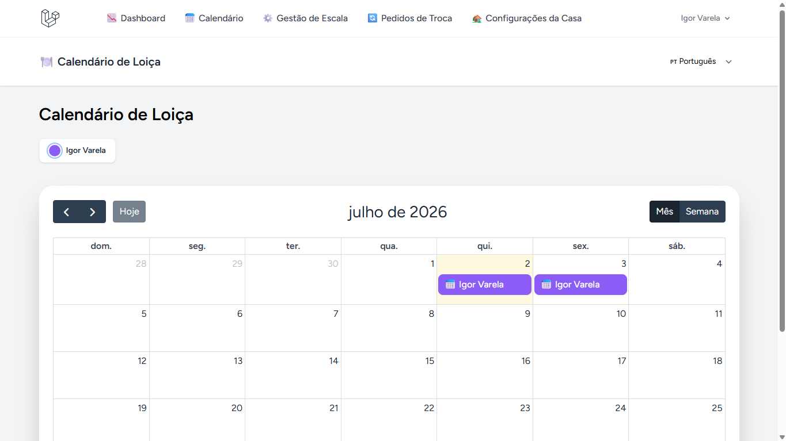
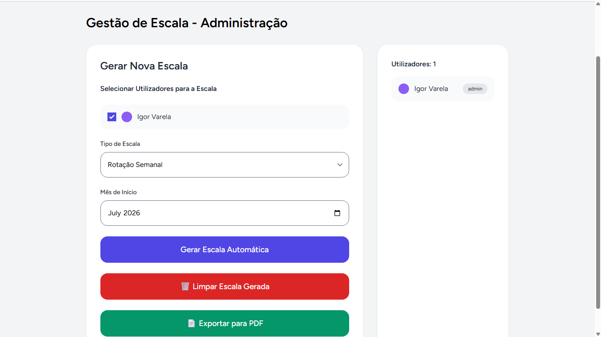
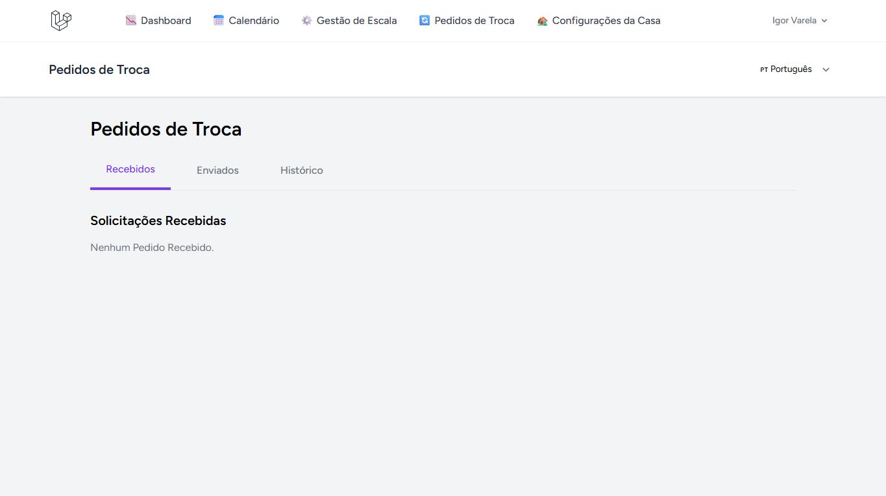
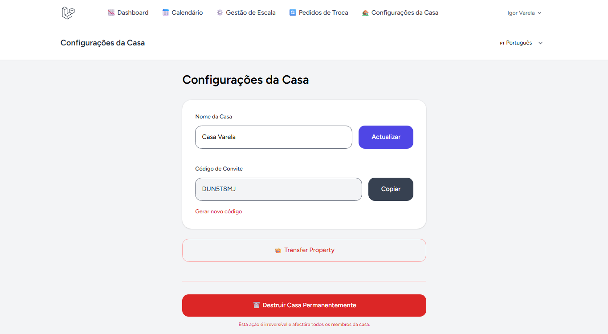

# 🧼 Dish Calendar

**Sistema de Gestão de Escala de Loiça** - Um sistema simples de gestão de escala de lavar loiça para casas e repúblicas.



## ✨ Sobre o Projeto

Dish Calendar é um sistema web desenvolvido para gerir de forma justa e transparente a escala de lavar loiça em casas, repúblicas ou famílias.
Este projeto nasceu de um problema real e recorrente na minha casa: discussões constantes sobre "quem lavou da última vez" e "quem lava agora".
Em vez de continuar a discutir, decidi construir uma solução.

**Não é um produto revolucionário.**

É apenas uma ferramenta prática que resolvi um problema específico.
O principal objetivo é **reduzir conflitos** entre membros da casa através de automação, transparência e um sistema simples de trocas.

---

## 🚀 Funcionalidades

### **Principais**
- **Calendário Interativo** com visualização mensal e semanal
- **Escala Automática** com lógica inteligente para fins de semana
- **Sistema de Trocas** com aprovação e justificativa
- **Prova Fotográfica** ao marcar como "Feito"
- **Gestão de Casas** (multi-tenancy) com códigos de convite
- **Notificações em Tempo Real** (Browser Push)
- **Dashboard** com estatísticas e leaderboard

---

### **Permissões**
- **Super Admin** - Acesso global
- **Admin** - Gestor da casa
- **User** - Utilizador normal

---

## 🛠 Tecnologias Utilizadas

- **Backend**: Laravel 11
- **Frontend**: Livewire 3 + Tailwind CSS
- **Calendário**: FullCalendar
- **Notificações**: Web Push + Laravel Notifications
- **Banco de Dados**: MySQL
- **Deploy**: Railway

---

## 📸 Screenshots

### Gestão de Casas


### Calendário


### Escala Automática


### Pedidos de Troca


### Configurações da Casa


### Dashboard


---

## Como testar o sistema
Pode visitar: https://dishcalendar.up.railway.app

---

## 🚀 Como Rodar Localmente

### Pré-requisitos
- PHP 8.2+
- Composer
- Node.js
- MySQL

### Passos

```bash
# 1. Clone o repositório
git clone https://github.com/Igor-de-Almeida/Dish-Washing-Calendar.git
cd dish-calendar

# 2. Instala dependências
composer install
npm install

# 3. Configura o ambiente
cp .env.example .env
php artisan key:generate

# 4. Configura a base de dados no .env e roda migrações
php artisan migrate
php artisan db:seed

# 5. Compila assets
npm run build

# 6. Inicia o servidor
php artisan serve
